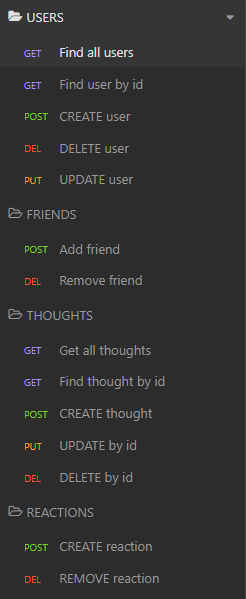

# Social Network API

## Table of Contents
  * [Description](#description)
  * [Installation](#installation)
  * [Usage](#usage)
  * [Technology](#technology)
  * [Contribution](#contribute)
  * [Tests](#tests)
  * [Questions](#questions)

## Description
This is an API for a social network web application where the following can be done:

Users:
* Get all
* Get one by id
* Create new
* Update one by id
* Delete one by id

Friends:
* Add to user
* Remove from user

Thoughts:
* Get all
* Get one by id
* Create new
* Update one by id
* Delete one by id

Reactions:
* Add to thought
* Remove from thought

To see how the API works using Insomnia, click [HERE](https://drive.google.com/file/d/1dAR1xPbSZheQU0kvm3dgnmrTmZ215TZV/view).

## Installation
 Before using this application, be aware you will need the following softwares installed already: 
  * VS Code 
  * GitBash 
  * Node.js
  * MongoDB
  * Insomnia

To install:
  - Click on the green "Code" button to clone or download to your folder 
  - To install dependancies needed, navigate to the main directory and run the following command: `npm i`

## Usage
To start the application, run `npm start`. Mongoose models will be synched to the MongoDB. To create data and test API routes, use Insomnia.

## Technology
  * JavaScript
  * Express.js
  * Node.js
  * MongoDB
  * Mongoose
  * Insomnia
  * Moment.js

## Contribution
No other contributors at the moment. If you'd like to contribute, feel free to contact me.

## Tests

USER

* Create a new user: POST /api/users

* Get all users: GET /api/users

* Get a single user by its id: GET /api/users/:userId

* Update a user by its id: PUT /api/users/:userId

* Delete a user by its id: DELETE /api/user/:userId

FRIEND

* Add a new friend to a user's friend list: POST /api/users/:userId/friends/:friendId

* Delete a friend from a user's friend list: DELETE /api/users/:userId/friends/:friendId

THOUGHT

* Create a new thought: POST /api/thoughts

* Get all thoughts: GET /api/thoughts

* Get a single thought by its id: GET /api/thoughts/:thoughtId

* Update a thought by its id: PUT /api/thoughts/:thoughtId

* Delete a thought by its id: DELETE /api/thoughts/:thoughtId

REACTION

* Create a reaction: POST /api/thoughts/:thoughtId/reactions

* Delete a reaction by the reactionId: DEL /api/thoughts/:thoughtId/reactions/:reactionId

## Questions
Have any questions? Please feel free to reach out!  
GitHub: https://github.com/ValPal1320  
Email: valgonzalez13@yahoo.com